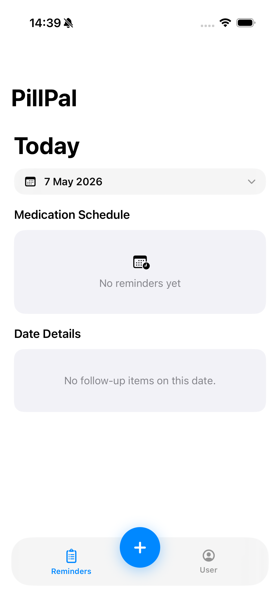
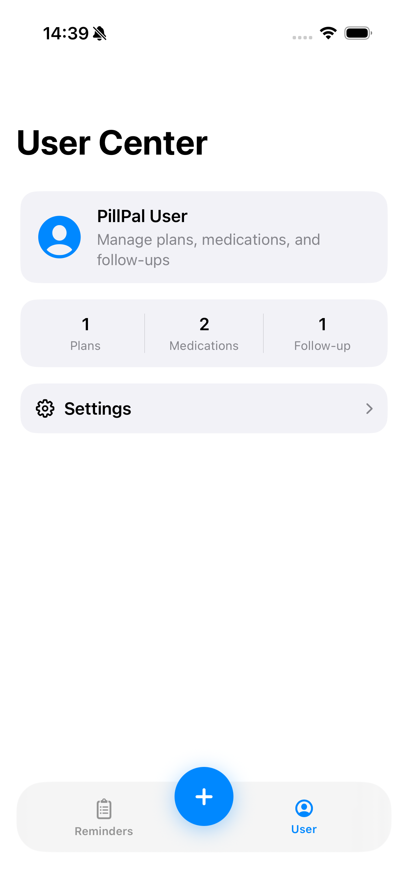
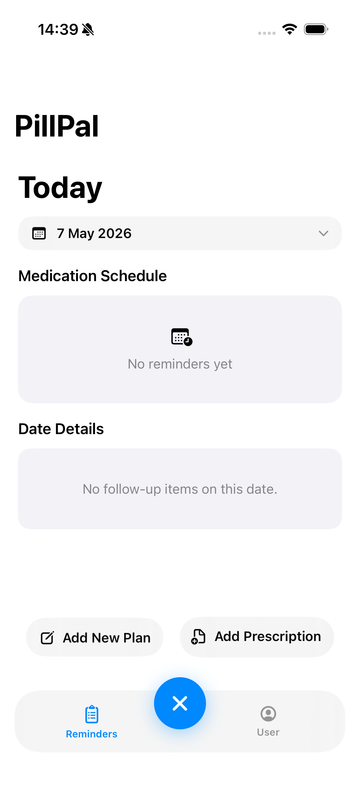
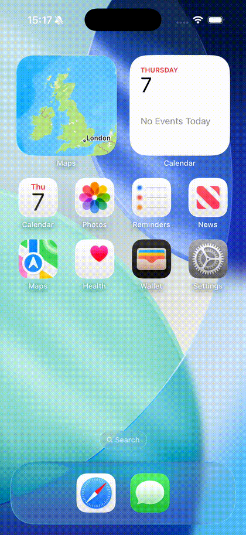

# PillPal (iOS 17+)

PillPal is a privacy-first SwiftUI medication assistant that turns prescription images into structured medication plans and local reminders.

## What it does (MVP)

- Multi-page prescription scan using `VisionKit` (`VNDocumentCameraViewController`)
- Per-page privacy redaction with brush (`PencilKit`)
- Irreversible pixel burn-in redaction before OCR
- OCR on redacted images only (`Vision`)
- Upload preview + explicit user consent gate
- LLM extraction to strict JSON (`DeepSeek chat completions`)
- Draft review/edit for medications, times, dates, notes, follow-ups
- Local reminders with actions (`Taken`, `Snooze 10 min`)
- Today schedule grouping (`Missing`, `Now`, `Later Today`, `Taken`)
- User Center with plans, medications, follow-ups, settings

## Privacy and security model

- Original unredacted scans are never uploaded to LLM endpoints.
- OCR is performed from redacted images only.
- Redaction burn-in uses opaque black pixels (no transparency).
- Sensitive OCR/request payloads are not logged.
- Upload requires explicit user consent.
- API keys are not committed. Use local `Config.plist` or env variables.

## Tech stack

- Swift 5.9+
- SwiftUI + NavigationStack
- iOS 17+
- VisionKit + PencilKit + Vision
- UserNotifications
- URLSession
- Local JSON persistence in Application Support

## Project structure

```text
PillPal/
  App/
  Models/
  Services/
  Utilities/
  Views/
  Resources/
```

Key services:

- `PillPal/Services/ScannerService.swift`
- `PillPal/Services/RedactionService.swift`
- `PillPal/Services/OCRService.swift`
- `PillPal/Services/LLMService.swift`
- `PillPal/Services/NotificationService.swift`
- `PillPal/Services/StorageService.swift`

## Setup

1. Open `PillPal.xcodeproj` in Xcode.
2. Create local runtime config:
   - Copy `PillPal/Resources/Config.example.plist` to `PillPal/Resources/Config.plist`
3. Set values in `Config.plist`:
   - `LLMEndpointURL` (default DeepSeek chat completions endpoint)
   - `LLMApiKey` (your key)
   - `LLMModel` (e.g., `deepseek-chat`)
4. Build/run on iPhone Simulator or device (iOS 17+).

Alternative key injection:

- `DEEPSEEK_API_KEY` (preferred)
- `LLM_API_KEY`
- `OPENAI_API_KEY` (legacy fallback key name)

## LLM response contract

`PillPal/Services/LLMService.swift` sends a strict JSON extraction prompt and decodes directly with `JSONDecoder` into:

- `LLMExtractionResult`
- `LLMMedication`
- `MedicationFrequency`
- `LLMUncertainty`

## Notifications behavior

- Schedules reminders from `startDate...endDate` inclusive for all medication times.
- Identifier format: `planId + medId + day + time` (stable and reversible).
- Actions:
  - `Taken`: marks completion in local app state
  - `Snooze 10 min`: one-off delayed reminder
- Deleting a plan cancels its pending and delivered notifications.

## UI screenshots

| Home | User Center | Add Menu |
| --- | --- | --- |
|  |  |  |
| **Caption:** Main reminders dashboard with schedule groups and date picker. | **Caption:** Profile hub with plan/medication/follow-up access and settings. | **Caption:** Center dock add action with quick entry choices. |

## Demo video



- Full quality MP4: [`docs/videos/pillpal-demo.mp4`](docs/videos/pillpal-demo.mp4)

## Notes

- `PillPal/Resources/Config.example.plist` is intentionally non-secret and safe to commit.
- `PillPal/Resources/Config.plist` is ignored by git.
